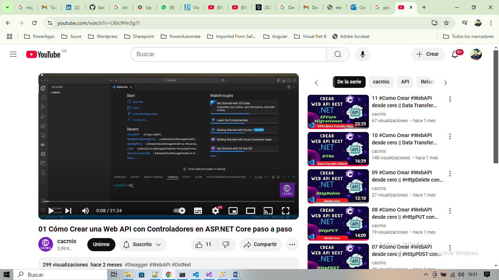
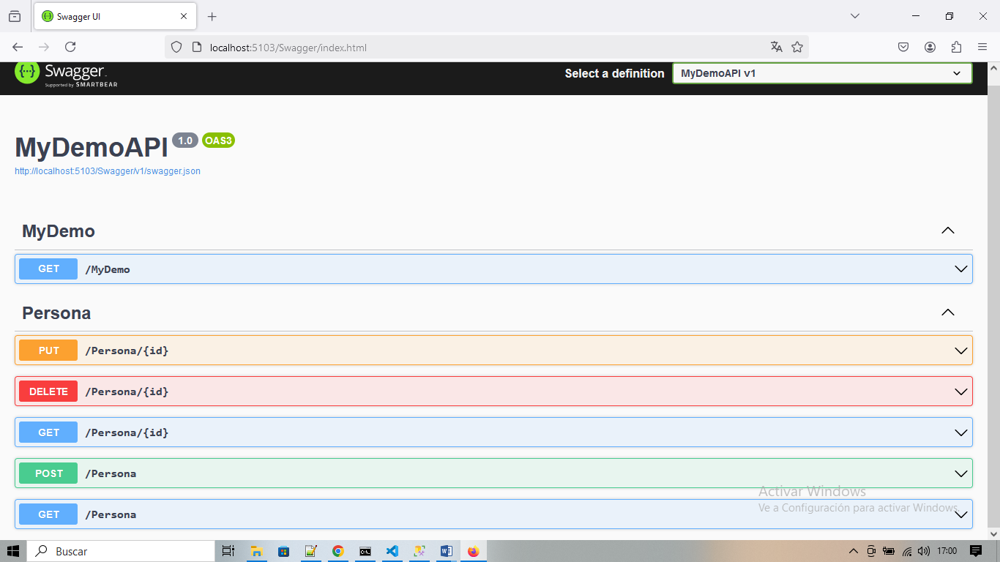
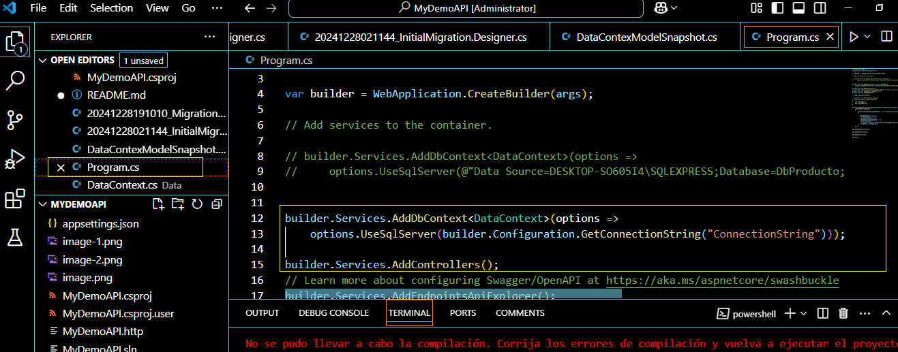
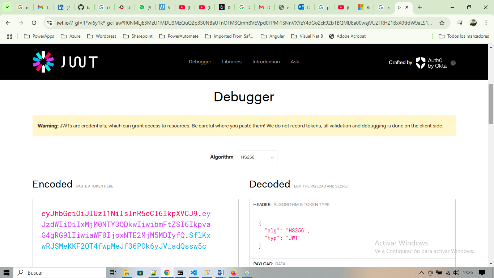
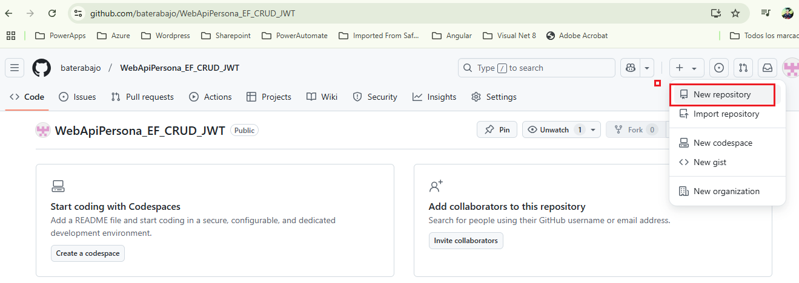

# WebApiPersona_EF_CRUD_JWT

WebApiPersona_EF_CRUD_JWT
WebApiPersona Datacontext EF EntityFrameworkCore CRUD Athorization con JWT Jeison Web Api

05 #Como Crear #WebAPI desde cero || #EFCore (Persistence)
https://www.youtube.com/watch?v=GCSOP_hsICs

scaffolding : es una técnica que genera código base para modelos de datos, como la creación, lectura, actualización y eliminación (CRUD). El término scaffolding significa literalmente "andamiaje".

dotnet new webapi --use-controllers -o MyDemoAPI
--dotnet new web -o DemoMinimalAPI

--Boy ala carpeta del proyecto

C:\>cd mydemoapi
C:\MyDemoAPI>code ..

Agrego package
dotnet add package NSwap.AspNetCore

Swagger (OpenAPI) es una especificación independiente del lenguaje que sirve para describir API REST.

http://localhost:5103/Swagger

asp.net core in NET 8.0 Scalffold a controller
dotnet add package Microsoft.EntityFrameworkCore.SqlServer

EFCore (Persistence) ala base de datos

Las herramientas de interfaz de la línea de comandos (CLI) para Entity Framework Core realizan tareas de desarrollo en tiempo de diseño. 
crean migraciones las aplican y generan código para un modelo según una base de datos existente. Los comandos son una extensión para el comando dotnet multiplataforma, que forma parte del SDK de .NET Core. Estas herramientas funcionan con proyectos de .NET Core.

dotnet tool install --global dotnet-ef

Microsoft.EntityFrameworkCore.SqlServer
Microsoft.EntityFrameworkCore.Tools
Microsoft.VisualStudio.Web.CodeGeneration.Design

dotnet add package Microsoft.EntityFrameworkCore.SqlServer
dotnet add package Microsoft.EntityFrameworkCore
dotnet add package Microsoft.EntityFrameworkCore.Design
dotnet add package Microsoft.EntityFrameworkCore.Tools

Agrego una carpeta Datay agreo la clase DataContext

namespace MyDemoAPI.Data
{
    public class DataContext : DbContext
    {
        public DataContext(DbContextOptions<DataContext> options) 
        : base(options)
        {
        }
        public DbSet<Persona> Personas { get; set; }
    }
}

Agregamos el string de conexion

appsettings.json
{
  "Logging": {
    "LogLevel": {
      "Default": "Information",
      "Microsoft.AspNetCore": "Warning"
    }
  },
  "AllowedHosts": "*",

  "ConnectionStrings":{
    "ConnectionString": "Data Source=DESKTOP-SO605I4\\SQLEXPRESS;Database=DbProducto;Integrated Security=True;TrustServerCertificate=Yes"
  }
}

Injeccion de dependencias en la clase Program.cs
Program.cs

builder.Services.AddDbContext<DataContex>(options =>
    options.UseSqlServer(builder.Configuration.GetConnectionString("ConnectionString")));

    

Agregamos estas librerias desdes la terminal
dotnet tool install --global dotnet-ef	
	
dotnet ef migrations add InitialMigration
dotnet ef database update

crear controlador PersonaController

using Microsoft.AspNetCore.Mvc;
using MyDemoAPI.Entities;
using MyDemoAPI.Data;
using Microsoft.EntityFrameworkCore;

namespace MyDemoAPI.Controllers
{

    [Route("[controller]")]
    public class PersonaController : ControllerBase
    {

        private readonly DataContext _context;

        public PersonaController(DataContext context)
        {
            _context = context;
        }

        

        [HttpPut("{id}")]
        public async Task<IActionResult> Put(int id, Persona persona)
        {
            if (id != persona.Id)
            {
                return BadRequest("Los ids no coinciden");
            }

            var personaExistente = await _context.Personas.FirstOrDefaultAsync(p => p.Id == id);

            if (personaExistente == null)
            {
                return NotFound("La persona no existe");
            }

            personaExistente.Nombre = persona.Nombre;
            personaExistente.Apellido = persona.Apellido;
            personaExistente.Edad = persona.Edad;
            
            try
            {
                _context.Update(personaExistente);
                await _context.SaveChangesAsync();
            }
            catch (Exception ex)
            {
                return BadRequest(ex.Message);
            }

            return Ok(personaExistente);
       }

        [HttpDelete("{id}")]
        public async Task<IActionResult> Delete(int id)
        {
            var persona = await _context.Personas.FirstOrDefaultAsync(p => p.Id == id);

            if (persona == null)
            {
                return NotFound("La persona no existe");
            }

            try
            {
                _context.Remove(persona);
                await _context.SaveChangesAsync();
            }
            catch (Exception ex)
            {
                return BadRequest(ex.Message);
            }

            return Ok(persona);
        }

        [HttpPost]
        public async Task<IActionResult> Post(Persona persona)
        {
            try
            {
                _context.Add(persona);
                await _context.SaveChangesAsync();
            }
            catch (Exception ex)
            {
                return BadRequest(ex.Message);
            }

            return Ok(persona);
        }

        [HttpGet]
        public async Task <IActionResult> Get()
        {
            var personas = await _context.Personas.ToListAsync();
            return Ok(personas);
        }

        [HttpGet("{id}")]
        public async Task <IActionResult> Get(int id)
        {
            var persona = await _context.Personas.FirstOrDefaultAsync(p => p.Id == id);
            return Ok(persona);
        }

        private IActionResult GetPersonas(int id)
        {
            var personas = _context.Personas.FirstOrDefault(p => p.Id == id);
            if (personas == null)
            {
                return NotFound($"La persona con el id {id} no fue encontrada");
            }
            return Ok(personas);
        }

    }
}

Un #DTO (Data Transfer Object) es un patrón de diseño utilizado en programación para transferir datos entre capas o procesos en una aplicación. En C#, los DTOs se implementan como clases o estructuras simples que contienen propiedades para transportar información sin lógica adicional.

¿Por qué usar DTOs?
1.- Separación de Concerns: Ayudan a separar la lógica de negocio (o de la base de datos) de las capas superiores como la interfaz de usuario o las APIs.
2.- Optimización del Transporte de Datos: Reducen el volumen de datos transferidos entre capas al enviar únicamente lo necesario.
3.- Seguridad: Ocultan detalles internos de los modelos o entidades del sistema.
4.- Compatibilidad: Facilitan la comunicación con otros sistemas, como APIs externas.

Migrations en EF Core
Las migraciones en EF Core son herramientas para sincronizar tu modelo de datos (clases de entidades) con la base de datos.

Cada vez que haces un cambio en tus entidades o en el modelo de datos, necesitas crear una migración para que EF Core actualice la estructura de la base de datos.

Terminal
dotnet ef migrations add MigrationActivoFechaNacimiento

Consumir un WebApi

Cree carpeta Services
	Crear interface IConsumirAPIPersona
	Crear class ConsumirAPIPersona
	
	

Add the Newtonsoft.Json NuGet package
dotnet add package Newtonsoft.Json

<ItemGroup>
  <PackageReference Include="Newtonsoft.Json" Version="13.0.1" />
</ItemGroup>

Comando para instalar los paquetes Nugget
dotnet add package Microsoft.IdentityModel.Tokens
dotnet add package System.IdentityModel.Tokens.Jwt
dotnet add package Microsoft.AspNetCore.Authentication.JwtBearer
dotnet add package Microsoft.AspNetCore.Mvc.NewtonsoftJson

https://jwt.io/?_gl=1*wi6y1k*_gcl_aw*R0NMLjE3MzU1MDU3MzQuQ2p3S0NBaUFnOFM3QmhBVEVpd0FPMi1SNnVXYzY4dGo2ck92b1BQMlJEa00wajVUZFRHZ1BxX0tfdW9aLS1CazFRanJoTlQ2VmUyQWlob0NUclVRQXZEX0J3RQ..*_gcl_au*MjM1Nzg2OTM3LjE3MzU1MDE3NzE.*_ga*MTY1ODIyNDg2Mi4xNzM1NTAxNzcy*_ga_QKMSDV5369*MTczNTUwNTY4OS4yLjEuMTczNTUwNTc2Ny41OC4wLjA.

Crear el repositorio en GitHub
Creo un nuevo repositorio WebApiPersona_EF_CRUD_JWT
WebApiPersona Datacontext EF EntityFrameworkCore CRUD Athorization con JWT Jeison Web Api

video visto Crear el repositorio en GitHub
https://www.youtube.com/watch?v=PSUiXSc8JWI&t=8s

Git ignore: crear un archivo nombre  .gitignore para que no suba archivos inecesarios
/carpetas
se vuelve gris la carpeta deja de ser verde
ver video ignorar carpetas uy archivos que no se necesitan

https://www.google.com/search?sca_esv=697ac3e2085e9089&sxsrf=ADLYWIJTOFLWgXvGOjfSJT1KR3btkk7EsA:1735598216058&q=gitignore&udm=7&fbs=AEQNm0CbCVgAZ5mWEJDg6aoPVcBgpXQ5X9i-z3TYttmvP7mO2cl8zerkKnj6Lepje0VGiR6L_1xT0VNfiBhNM7YKKGoNGCEe9AOa9DVL6REMCcLSDosjQ_NYOluubkhDdFtsjjbPCdcbMxma48Bzm2dE33vp0xhgrSivA3XJuvqU2v1-cQUFttfK15J2fZ0Xs5jZRpqrZFZIcbVkLFDIEw8_h5rVyRvCvg&sa=X&sqi=2&ved=2ahUKEwili5CZx9CKAxW4SDABHTgWDDUQtKgLegQIFhAB&biw=1366&bih=617&dpr=1#fpstate=ive&vld=cid:82327361,vid:TLLzSvcoVQg,st:0

…or create a new repository on the command line
echo "# WebApiPersona_EF_CRUD_JWT" >> README.md
git init
git add README.md
git commit -m "first commit"
git branch -M main
git remote add origin https://github.com/baterabajo/WebApiPersona_EF_CRUD_JWT.git
git push -u origin main

…or push an existing repository from the command line
git remote add origin https://github.com/baterabajo/WebApiPersona_EF_CRUD_JWT.git
git branch -M main
git push -u origin main